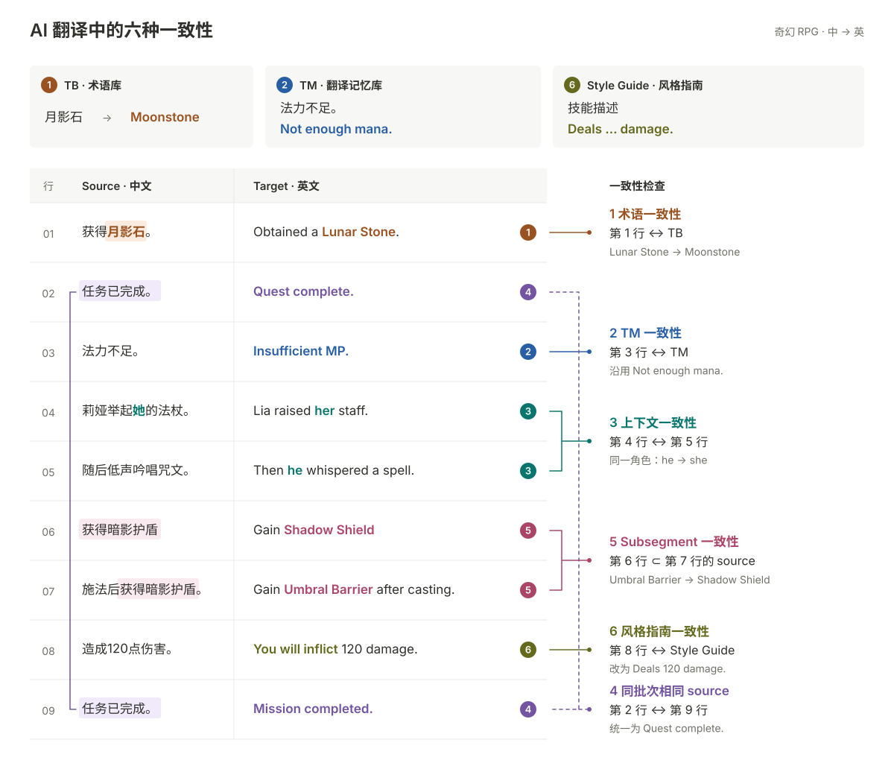

一句 AI 译文即使读起来通顺，也可能与术语库、已有译文、其他句段或项目风格指南不一致。下面用一组奇幻 RPG 游戏文本，看看这些差异发生在哪里。

## 01 · 术语一致性

项目术语库（TB）规定「月影石」译为 **Moonstone**。第 1 行却用了 **Lunar Stone**。

- 原文：获得月影石。
- 当前：Obtained a **Lunar Stone**.
- 建议：Obtained a **Moonstone**.

检查的是句段中的用词是否符合当前项目的术语规范。

## 02 · TM 一致性

翻译记忆库（TM）中，「法力不足。」已有确认译文 **Not enough mana.**。第 3 行的 **Insufficient MP.** 虽然意思相近，却没有沿用同一条提示的既有表达。

- 原文：法力不足。
- 当前：**Insufficient MP.**
- 建议：**Not enough mana.**

对照的是当前句段与项目中仍然适用的 TM 记录。

## 03 · 上下文一致性

第 4 行「莉娅举起她的法杖。」译为 **Lia raised her staff.**。紧接着，第 5 行「随后低声吟唱咒文。」却译为 **Then he whispered a spell.**

后一句省略了主语，仍在描写莉娅，英文指代需要接上前文。

- 当前：Then **he** whispered a spell.
- 建议：Then **she** whispered a spell.

这里需要检查相邻句段的语义关系，而不只是寻找相同的词。

## 04 · 同批次相同 source

第 2 行和最后的第 9 行，都是同一条任务完成提示「任务已完成。」，却出现了两种译法。

- 第 2 行：**Quest complete.**
- 第 9 行：**Mission completed.**
- 建议：统一为 **Quest complete.**

对照内容就在当前批次里，两行可以相隔很远，也不一定已经进入 TM。是否统一，要结合重复原文的实际用途判断。

## 05 · Subsegment 一致性

第 6 行的完整原文「获得暗影护盾」，原样出现在第 7 行「施法后获得暗影护盾。」中，英文技能效果名却发生了变化。

- 第 6 行：Gain **Shadow Shield**
- 第 7 行：Gain **Umbral Barrier** after casting.
- 建议：Gain **Shadow Shield** after casting.

这里比较的是短句与长句中的相同片段。英文语序可以随整句调整，但同一个技能效果的名称需要保持一致。

## 06 · 风格指南一致性

术语和句意都正确，译文仍可能不符合项目的表达规范。例如：

- 技能描述统一用 `Deals … damage.`，有些句子却突然改成 `You will inflict … damage.`。
- 同一位古典口吻的法师，无缘由地从庄重措辞变成现代俚语。
- 技能名的大小写、数值单位、标点格式前后不统一。

图中第 8 行「造成120点伤害。」就偏离了技能描述的句式规范。

- 当前：**You will inflict** 120 damage.
- 建议：**Deals** 120 damage.

这类问题不一定能通过 TB 或 TM 发现，需要对照 **Style Guide、角色语言设定和格式规范**。
