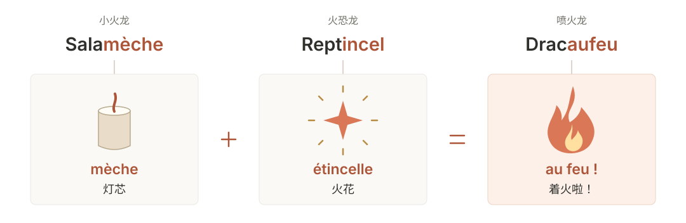

Libération 做过一个很有意思的专题：[《Pokémon, traduisez-les tous》](https://www.liberation.fr/apps/2016/06/pokemon/)，请 Julien Bardakoff 把第一代宝可梦的法语名字逐个拆开讲。他聊到日文原名里的双关，也聊到法语译名是怎么想出来的。

有些名字一看就懂，有些还真得听他解释。下面这几组尤其值得一说。

## 御三家：名字也会一起进化

### 妙蛙种子一家

| 宝可梦 | 日本語 | Français |
| --- | --- | --- |
| [妙蛙种子](preview:bulbizarre) | **フシギ**ダネ | Bulb**izarre** |
| [妙蛙草](preview:herbizarre) | **フシギ**ソウ | Herb**izarre** |
| [妙蛙花](preview:florizarre) | **フシギ**バナ | Flor**izarre** |

先看日文。共同的 **フシギ（不思議）** 是「奇怪、不可思议」，后面的 **ダネ、ソウ、バナ** 则分别对应种子、草和花。妙蛙种子的名字 **フシギダネ**，念起来又是「不思議だね」——「真奇怪啊」。

Bardakoff 在笔记里把前两个名字想象成研究者的一问一答：一个看着小家伙说「真奇怪啊」，另一个用 **フシギソウ** 接话，「是挺奇怪的」。名字既在说植物，又像随口说出来的一句话。[命名笔记](https://www.liberation.fr/apps/2016/06/pokemon/#item-3o)

法语没能把这段对话也带过去，但留下了「奇怪」和植物的组合：**bulbe** 是球茎，**herbe** 是草，**flor-** 是花的词根，**bizarre** 则是「奇怪的」。日文把共同的 フシギ 放在开头，法文把相近的声音留在末尾；两边的名字念下来，都能听出它们是一家子。

### 小火龙一家

| 宝可梦 | 日本語 | Français |
| --- | --- | --- |
| [小火龙](preview:salameche) | ヒトカゲ | Sala**mèche** |
| [火恐龙](preview:reptincel) | リザード | Rept**incel** |
| [喷火龙](preview:dracaufeu) | リザードン | Drac**aufeu** |

小火龙的日文名 **ヒトカゲ（Hitokage）**，换个地方断开，就有两种读法：

  
<strong>ヒ</strong> ＋ トカゲ火 ＋ 蜥蜴

  
ヒト ＋ <strong>カゲ</strong>人 ＋ 影

Bardakoff 由后一种读法联想到：小火龙尾巴上的火，能在洞壁上照出影子。这层双关到了法语里留不住，他便把另一个笑话拆进了三次进化里：[命名笔记](https://www.liberation.fr/apps/2016/06/pokemon/#item-6o)

这三个法语名字的前半截也各有来历：salamandre（蝾螈）、reptile（爬行动物）和 dragon（龙）。后半截连起来，才是「灯芯加火花，着火啦」。[本人访谈](https://leclaireur.fnac.com/article/324679-salameche-canarticho-carapuce-linventeur-des-noms-de-pokemons-nous-revele-les-secrets-de-leur-creation/)

单独看，每个名字都能对上角色的样子。连起来才发现，原来从小火龙开始就在铺垫了。

### 杰尼龟一家

| 宝可梦 | 日本語 | Français |
| --- | --- | --- |
| [杰尼龟](preview:carapuce) | ゼニガメ | Cara**puce** |
| [卡咪龟](preview:carabaffe) | カメール | Cara**baffe** |
| [水箭龟](preview:tortank) | カメックス | Tor**tank** |

**ゼニガメ（Zenigame）** 里的 **ゼニ（銭）** 是钱币，**カメ（亀）** 是龟。Bardakoff 读到的是一只钱币般小巧的龟，于是用了 **carapace（甲壳）＋ puce（跳蚤）**，组成 Carapuce。钱币换成跳蚤，小小一只的感觉还在。[命名笔记](https://www.liberation.fr/apps/2016/06/pokemon/#item-9o)

进化成 **Carabaffe**，名字里就有了 **baffe（巴掌）**。到了最后，日文的 **カメックス** 让译者想到怪兽名字和 max 的音感；法文则用 **tortue（龟）＋ tank（坦克）**，直接变成 Tortank。[命名笔记](https://www.liberation.fr/apps/2016/06/pokemon/#item-11o)

前两个法语名字念着还挺可爱，Tortank 就没那么客气了。看看水箭龟背上那两根炮管，倒也合适。

## 胖丁的名字里有糖

| 宝可梦 | 日本語 | Français |
| --- | --- | --- |
| [胖丁](preview:rondoudou) | プリン | Ron**doudou** |

**プリン（Purin）** 就是布丁。只看中文「胖丁」，不太容易想到它原本直接叫一种甜点。Bardakoff 想沿着甜食的方向找，于是选中了法国的一种老式糖果 [roudoudou](preview:roudoudou-candy)，再把 **rond（圆）** 和 **doux（柔软的）** 放进去，改成 Rondoudou。[命名笔记](https://www.liberation.fr/apps/2016/06/pokemon/#item-41o)

布丁换成了糖果，甜甜软软的感觉还在。尤其是后面重复的 **dou-dou**，念着就很像给小朋友起昵称的口气。哪怕不知道这种糖，看着胖丁圆滚滚的样子，也觉得叫这个名字挺合适。

## 九尾：倒过来看看

| 宝可梦 | 日本語 | Français |
| --- | --- | --- |
| [九尾](preview:feunard) | **キュウ**コン | **Feun**ard |

日文的 **キュウコン（Kyūkon）** 已经把「九」写进了读音：**キュウ（kyū）** 是九，**コン（kon）** 则是日语里狐狸的叫声。这是 Bardakoff 在笔记中给出的拆法。[命名笔记](https://www.liberation.fr/apps/2016/06/pokemon/#item-40o)

到了 **Feunard**，能认出 **feu（火）** 和 **renard（狐狸）**，九却好像不见了。其实，把开头的 **feun** 倒过来，恰好就是 **neuf（九）**。

**NEUF → FEUN → FEUNARD**

这个 neuf 藏得太顺了，没人提醒还真不容易发现。Bardakoff 自己也颇为得意，在笔记里讲完词源，还提议让它进最佳译名的前三名。

## 大针蜂，还是一位火枪手

| 宝可梦 | 日本語 | Français |
| --- | --- | --- |
| [大针蜂](preview:dardargnan) | スピアー | **Dard**argnan |

日文名 **スピアー（Supiā）** 来自英语 **spear**，也就是「长矛」。原名已经指向了它身上的武器，法语顺着这个方向，又多走了几步。

**Dardargnan** 一口气凑了三个梗：**dard** 是螫针，**dare-dare** 是「赶紧、飞快地」，还有《三个火枪手》里的 **d’Artagnan（达达尼昂）**。[命名笔记](https://www.liberation.fr/apps/2016/06/pokemon/#item-17o)

两根长针像剑，动作又快，于是就借了达达尼昂的名字。知道这个梗以后，再看大针蜂伸着双针的样子，倒真有点剑客的架势。

## 大葱鸭，名字里却有朝鲜蓟

| 宝可梦 | 日本語 | Français |
| --- | --- | --- |
| [大葱鸭](preview:canarticho) | カモ**ネギ** | Can**articho** |

日文 **カモネギ（Kamonegi）** 拆开是 **カモ（鸭）＋ ネギ（葱）**，中文名也是这两样东西。但日本读者还能想到一句俗语：

> 鴨が葱を背負って来る。 
> 鸭子背着葱来了。

鸭子自己送上门，连下锅的配菜都带好了。这句话说的是好事送上门、事情对自己格外有利，也常用在占便宜的语境里。知道这个梗，再看它随身带着的葱，就有点替它担心了。[俗语释义](https://www.kanjipedia.jp/kotoba/0000536100)

这层意思很难挪进一个法语名字。Bardakoff 最后选的是 **canard（鸭子）＋ artichaut（朝鲜蓟）**，组成 Canarticho。

可它拿的明明是葱。

Bardakoff 当然知道。在后来的访谈里，他说自己顺着 canard 的发音往下找，想到 artichaut，就觉得 Canarticho 很好玩。至于手里拿的根本不是朝鲜蓟——他喜欢的恰恰就是这种荒诞。[本人访谈](https://leclaireur.fnac.com/article/324679-salameche-canarticho-carapuce-linventeur-des-noms-de-pokemons-nous-revele-les-secrets-de-leur-creation/)

于是，大葱鸭就带着一株和名字对不上的葱，留在了法语图鉴里。
